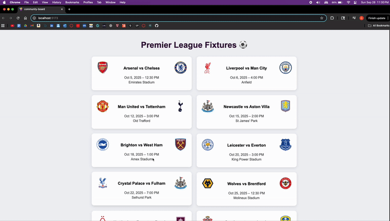

# Premier League Fixtures Board ⚽️

A React + Vite web app that displays upcoming Premier League fixtures in a clean, responsive card grid.  

---

## 🌍 Live Demo
👉 [Click here to view the live app](https://amalick8.github.io/Premier-League-Community-Board/)  

---

## 📸 Preview
  

*(The GIF above shows the app running and resizing responsively.)*  

---

## 🎯 Features
- [x] Unique theme (Premier League fixtures board)  
- [x] Header/title describing the theme  
- [x] 12 unique matches displayed  
- [x] Responsive card grid layout  
- [x] Each card includes: teams, logos, date, time, and stadium  
- [x] Hover effects on cards  

---

## 🚀 Getting Started

Clone the repo and install dependencies:

```bash
git clone https://github.com/amalick8/Premier-League-Community-Board.git
cd Premier-League-Community-Board
npm install
npm run dev
